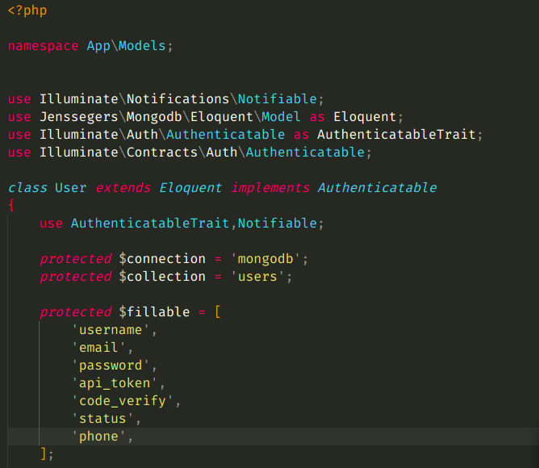

#   
 authentication api token for mongodb 

## install 
 >  composer require esperlos98/esauthenticationmongo

## add middlware EsAuthenticationCheckEncrypt to App\Http\Kernel.php
       'api' => [
            // \Laravel\Sanctum\Http\Middleware\EnsureFrontendRequestsAreStateful::class,
            'EsAuthenticationCheckEncrypt', //this
            'throttle:api',
            \Illuminate\Routing\Middleware\SubstituteBindings::class,
        ],
   
## add api drive  config/auth.php array guards and use middleware auth:apiMongo
    guards[

        'apiMongo' => [
            'driver' => 'token',
            'provider' => 'users',
        ],
    ]

## using middleware for exsample
> 
   

## Config model User  /app/Models/User.php
fillable add api_token

## for exsample
> 
   

## publish config 
 >
 > php artisan vendor:publish --tag=config

 ##  Config esauthenticationMongo   /config/esauthentication

 ># 
Note
 
 > in config User adding any field 
 > if you  wanting can change login of email to username or anything
 > 
 and remove from Login email 

     
     "rules" => [
        "Register" => [
            'username' => 'required',
            'email' => 'required|email|unique:mongodb.users',
            'password' => 'required|confirmed|min:8',
            'phone' => 'required|unique:mongodb.users',
            'status' => 'boolean',
            'api_token' => 'unique:mongodb.users'
        ],

        "Login" => [
            'username' => 'required',
            'password' => 'required',
        ],

        "Verfiy"=>[
            'id' => 'required',
            'code' => 'required|numeric',
        ],
    ],

    "massages" => [
        "required" => 601,
        "confirmed" => 602,
        "min" => 603,
        "email" => 604,
        "unique" => 605,
        "numeric" => 606,
    ],

    "userFileds" => [
        "username" => "username",
        "phone" => "phone",
        "email" => "email",
        "password" => "password",
        "code_verify" => "code_verify",
        "status" => "status"
    ],

    "username" => "email", //here change to anything
    "safeCode" => true, // for length code verfiy  four or five 

## Routings
> ### for login 
> 
yourdomine/api/es/v1/login

> 
parameters : username ,password
 

> ### for register  
> 
youerdomine/api/es/v1/register

> 
parameters : email , username , password , password_confirmation

> ### for register  
> 
youerdomine/api/es/v1/verfiy

> 
parameters : code , id 

